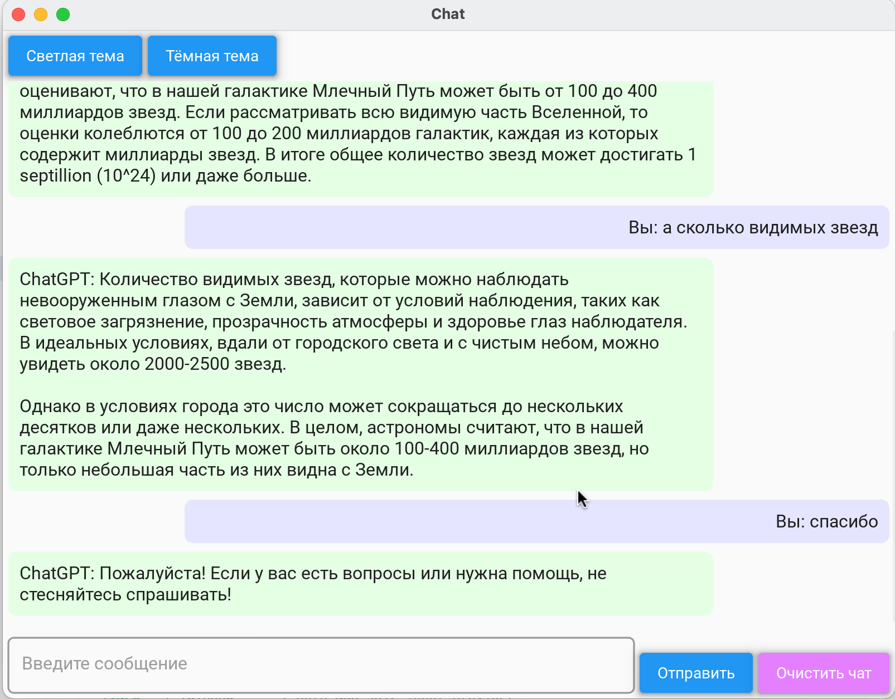

# **Chat App Bot**

An intuitive and interactive chat application built using KivyMD and powered by the OpenAI ChatGPT API, enabling users to engage in intelligent conversations with a responsive bot, switch between light and dark themes, and manage chat history.

---

## **Features**

* **Light/Dark Theme Toggle** : Easily switch between light and dark themes for better user experience.
* **Chat History Management** : Save, load, and clear chat history with simple controls.
* **Interactive UI** : Clean and modern interface with responsive chat bubbles.
* **API Integration** : Leverages the GPT-4.0 API for intelligent responses.
* **Customization** : Adjustable interface themes and user-friendly design.

## **Screenshot**

Bot Interface



## **Installation**

1.             Clone the repository:

```
git clone https://github.com/shereshevskiy/chat_app_bot.git
cd chat_app_bot
```

2. Create a virtual environment and activate it:

```
python -m venv venv
```

```
source venv/bin/activate  
```

On Windows, use

`venv\Scripts\activate`

3.             Install dependencies:

```
pip install -r requirements.txt
```

4.             Add a .env file to the root directory with your API key:

```
vsegpt_api_key=your_api_key_here
```

## **Usage**

1.             Run the application:

```
python bot.py
```

2.             Use the buttons to toggle themes, send messages, and clear chat history.

3.             Chat history is automatically saved and can be reloaded when the application restarts.

## **Project Structure**

•               bot.py: Main application file.

•               requirements.txt: Python dependencies.

•               .env: Contains API keys (not included in version control).

•               chat_history.json: Chat history saved locally.

## **Requirements**

•               Python 3.8 or higher

•               Libraries: kivy, kivymd, requests, python-dotenv

## **Contributing**

Contributions are welcome! Please fork the repository, make
your changes, and submit a pull request.

## **License**

This project is licensed under the MIT License. See the [LICENSE](LICENSE) file for details.

## **Контакт**

Если у вас возникли вопросы или предложения, пишите на [d.shereshevskiy@gmail.com](mailto:d.shereshevskiy@gmail.com).
